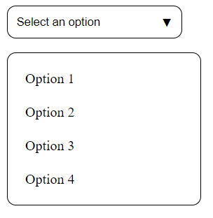

Custom Dropdown Component

Web link - https://abh7n.github.io/custom-dropdown/

A reusable, accessible, and customizable dropdown component built with HTML, CSS, and JavaScript.

Features

- Customizable dropdown list with dynamic content support
- Accessible keyboard navigation and screen reader support
- Responsive design for various screen sizes
- Easy integration with existing projects

Installation

To use this custom dropdown component, simply clone this repository or copy the necessary files into your project:

bash
git clone (link unavailable)

Usage

1. Include the CSS file (style.css) in the <head> section of your HTML document.
2. Add the dropdown HTML structure to your document.
3. Include the JavaScript file (script.js) before the closing </body> tag.
4. Initialize the dropdown by calling the Dropdown function and passing the dropdown container element.

Example

<!-- HTML -->

  <button class="dropdown-button">Select an option</button>
  <ul class="dropdown-list">
    <li class="dropdown-item">Option 1</li>
    <li class="dropdown-item">Option 2</li>
    <li class="dropdown-item">Option 3</li>
  </ul>

// JavaScript
const dropdown = document.querySelector('.dropdown');
const dropdownInstance = new Dropdown(dropdown);

Configuration Options

The following options can be customized:

- dropdownClass: CSS class for the dropdown container (default: .dropdown)
- buttonClass: CSS class for the dropdown button (default: .dropdown-button)
- listClass: CSS class for the dropdown list (default: .dropdown-list)
- itemClass: CSS class for individual dropdown items (default: .dropdown-item)

Browser Support

This custom dropdown component supports modern browsers, including:

- Google Chrome
- Mozilla Firefox
- Safari
- Microsoft Edge

License

This project is licensed under the MIT License.

Contributing

Contributions are welcome! Please submit a pull request with your changes.

Authors

- (link unavailable)

Version History

